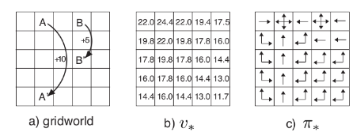

# 强化学习（Reinforcement Learning）

## 简介

### 机器学习的分类
- 监督学习
- 非监督学习
- 强化学习

### 强化学习的提出
- 我们如何认识这个世界？

举个例子， 一个小孩看到一堆火

他可以靠近火

也可以摸一摸这把火

小孩子不同的行为结果是不一样的，当他靠近火的时候，他得到了温暖，感到舒适，是一种奖励。而当他真的摸一把的时候会烫到手，感到疼痛，是一种惩罚。这就是我们生活中学习的过程，强化学习是参考这个过程发明的机器学习方法。

- 智能体和环境

强化学习中有两个对象，
一个是智能体（Agent），就是我们要训练的智能
一个是环境（Environment ），就是智能体要跟他交互的环境的总和。

环境有各种状态
智能体可以采取不同的行动
在不同的环境状态下，智能体采取不同的行动会有不同的结果，就像我们上面的例子下孩子靠近火或者摸火就是两个不同的行动。反过来，智能体的行动也会使环境变成另外的状态。

智能体不同行动所带来的结果我们用`奖励`来描述。像上面的例子，靠近火的时候奖励是`+1`,摸火的时候奖励是`-1`,即不靠近火也不摸火的时候奖励是`0`。

- 奖励

所以智能体学习的过程可以归结为奖励最大化的优化问题。

- 强化学习过程

- 奖励最大化

这就是为什么在强化学习中，为了获得最佳行为，我们需要最大化预期的累积奖励。每个时间步t的累积奖励可定义为：

相当于：

- 折扣奖励

想一想我们身边的例子，我们在做决策的时候总是考虑短期利益和长期利益，短期利益和长期利益不一定是统一的，这时候就要在短期利益和长期利益之间做平衡，增强学习在实现的时候用的是折扣，就是给长期利益打折。
为了给奖励打折，可以这样做：
我们定义了一个名为gamma的折扣率。它必须介于0和1之间。伽玛越大，折扣越小。这意味着学习，agent更关心长期奖励。
另一方面，伽玛越小，折扣越大。这意味着我们的 agent 更关心短期奖励。
累积的折扣预期奖励是：

- Exploration/Exploitation trade off (探索/利用 权衡)

在研究解决强化学习问题的不同策略之前，我们必须涵盖另一个非常重要的主题：`探索/利用` 权衡。
探索是寻找有关环境的更多信息。
利用是利用已知信息来最大化奖励。
请记住，我们的RL智能体的目标是最大化预期的累积奖励。但是，我们可能会陷入局部陷阱。

在这个游戏中，我们的x小老鼠可以有无限量的小奶酪（每个+1）。但在迷宫的顶端有一大片奶酪（+1000）。
但是，如果只专注于奖励，agent永远不会达到巨大的奶酪。它只会得到最近的奖励来源，即使这个来源很小（利用）。
但如果我们的智能体进行了一些探索，那么它就有可能获得巨大的回报。
这就是我们所说的勘探/开采权衡。我们必须定义一个有助于处理这种权衡的规则。我们将在以后的文章中看到处理它的不同方法。
举个例子：

在这个游戏中，我们的鼠标可以有无限量的小奶酪（每个+1）。但在迷宫的顶端有一大片奶酪（+1000）。
但是，如果只专注于奖励，agent永远不会达到巨大的奶酪。它只会得到最近的奖励来源，即使这个来源很小（利用）。
但如果我们的智能体进行了一些探索，那么它就有可能获得巨大的回报。
这就是我们所说的勘探/开采权衡。我们必须定义一个有助于处理这种权衡的规则。我们将在以后的文章中看到处理它的不同方法。

生活中这种权衡其实也是不剩枚举的。。。

### 任务分类

情节性任务 或 连续性任务 （Episodic or Continuing tasks）
- 情节性任务：

这种情况下，强化学习任务会有一个起点和终点（一个最终状态）。这会创建一个剧情：一个状态States, 行动Actions, 奖励Rewards, 新状态 New States的列表。例如：游戏的一关

- 连续性任务：

这些是永远持续的任务（没有终点状态）。在这种情况下，agent必须学习如何选择最佳操作并同时与环境交互。
例如， agent  进行自动股票交易。对于此任务，没有起点和终点状态。agent 会持续执行，直到我们决定阻止他。

### 不同的学习过程

- Monte Carlo （蒙特卡洛）

在剧集结束时收集奖励，然后计算最大预期未来奖励
当剧集结束时（智能体达到“终端状态”），Agent会查看总累积奖励，看看它的表现如何。在蒙特卡洛方法中，奖励仅在比赛结束时收到。
然后，我们运用学到知识开始一个新的游戏。 Agent 会在每次迭代时做出更好的决策。

举个例子：

如果我们采取迷宫环境：

总是从同一个起点开始。
如果猫吃了老鼠或者老鼠移动超过20步，我们就会终止这一集剧情。
在剧集结束时，我们有一个 State， Actions,  Rewards, 和 New States的列表
奖励总额Gt被统计（看看老鼠的表现如何）。
根据上面的公式更新V(st)。
然后用这个新知识开始一个新游戏。
通过运行越来越多的剧集， Agent  将学会更好, 并更好地发挥。

- Temporal Difference Learning （时序差分方法）

TD学习不会等到剧集结束时更新最大预期未来奖励估计：它将更新其在该经历中发生的非最终状态St的价值估计V.
该方法称为TD(0) 或一步TD（在任何单个步骤之后更新值函数）。

TD方法只等到下一步更新值估计值。在时间t + 1，它们使用观察到的奖励Rt + 1和当前估计值V(St + 1)立即得到TD目标。
TD目标是一个估计值：事实上，可以通过将其更新为一步目标来更新先前估计V(St)。

### 不同的学习方法

- 基于价值

在基于数值的RL中，目标是优化价值函数  V（s）。
价值函数是一个函数，表明agent在每个状态获得的最大预期未来奖励。
每个状态的数值是以该状态为起始点，agent在未来积累的奖励总额的期望。

Agent使用此函数在逐步地中选择的状态，使其获得期望最大。

在迷宫示例中，在每个步骤中我们将采用最大值：-7，然后是-6，然后是-5（依此类推）以达到目标。

- 基于策略

在基于策略的RL中，我们希望在不使用值函数的情况下直接优化策略函数  π（s）。
该策略定义了给定时间的智能体行为。

action = policy（state）

通过学习一种策略函数。这使我们得到每个状态到最佳的相应操作的映射。

我们有两种策略类型：
1. 确定性：给定状态下的策略将始终返回相同的操作。
1. 随机：输出行动上的分别概率。

正如我们在此处看到的，该策略直接指出了针对每个步骤采取的最佳操作。

- 基于模型

在基于模型的RL中，我们对环境进行建模。这意味着我们创建了一个环境行为的模型。
问题是每个环境都需要不同的模型表示。这就是为什么我们不会在即将发表的文章中谈论这种类型的强化学习。

### 学习的目的

- 学习和规划 （Learning & Planning）

1. 学习：
环境初始时是未知的，个体不知道环境如何工作，个体通过与环1境进行交互，逐渐改善其行为策略。

2. 规划: 
环境如何工作对于个体是已知或近似已知的，个体并不与环境发生实际的交互，而是利用其构建的模型进行计算，在此基础上改善其行为策略。
一个常用的强化学习问题解决思路是，先学习环境如何工作，也就是了解环境工作的方式，即学习得到一个模型，然后利用这个模型进行规划。

- 探索和利用 （Exploration & Exploitation）
强化学习类似于一个试错的学习，个体需要从其与环境的交互中发现一个好的策略，同时又不至于在试错的过程中丢失太多的奖励。探索和利用是个体进行决策时需要平衡的两个方面。
一个形象的比方是，当你去一个餐馆吃饭，“探索”意味着你对尝试新餐厅感兴趣，很可能会去一家以前没有去过的新餐厅体验，“利用”则意味着你就在以往吃过的餐厅中挑一家比较喜欢的，而不去尝试以前没去过的餐厅。这两种做法通常是一对矛盾，但对解决强化学习问题又都非常重要。
其它一些例子，在线广告推广时，显示最受欢迎的广告和显示一个新的广告；油气开采时选择一个已知的最好的地点同在未知地点进行开采；玩游戏时选择一个你认为最好的方法同实验性的采取一个新的方法。

- 预测和控制 （Prediction & Control）

在强化学习里，我们经常需要先解决关于预测（prediction）的问题，而后在此基础上解决关于控制（Control）的问题。
预测：给定一个策略，评价未来。可以看成是求解在给定策略下的价值函数（value function）的过程。How well will I(an agent) do if I(the agent) follow a specific policy?
控制：找到一个好的策略来最大化未来的奖励。
举了一个例子来说明预测和控制的区别。
预测：现在给出了从A到A’的奖励以及从B到B’的奖励，在“随机选择4个方向进行移动”的策略下，如何得知每一个位置的价值。

控制：同样的条件，在所有可能的策略下最优的价值函数是什么？最优策略是什么？

### 马尔可夫属性

一个状态St是马尔可夫的，当且仅当

也就是说，如果信息状态是可知的，那么所有历史信息都可以丢掉，仅需要 t 时刻的信息状态就可以了。例如：环境状态是Markov的，因为环境状态是环境包含了环境决定下一个观测/奖励的所有信息；同样，（完整的）历史 Ht 也是马尔可夫的。

## Q-Learning -- Q学习

[Q-Learning](https://www.yanxishe.com/TextTranslation/1394)

[Bellman方程](https://zhuanlan.zhihu.com/p/35261164)

Watch Q-Learning Video：
链接: https://pan.baidu.com/s/1xInpqQ5Ev7NWLDYkBA_gJA 提取码: tiiy
     Q-learning with numpy and OpenAI Taxi-v2.mp4

[Q-Learning Notebook](https://github.com/simoninithomas/Deep_reinforcement_learning_Course/tree/master/Q%20learning/FrozenLake)

## Deep Q-Learning -- 深度Q学习

为什么需要 Deep Q-Learning？
一个拥有巨大状态空间（数百万不同state）的大环境，没有办法列出Q-Table，我们用一个黑盒子的NeuralNetwork来替代Q-Table

### 几个问题

- 时间限制的问题
- 为什么使用卷积网络
- 避免忘记以前的经历
- 减少经验之间的相关性（探索）

[Deep Q-Learning](https://www.yanxishe.com/TextTranslation/1395)

[Explain of CNN](https://medium.com/@ageitgey/machine-learning-is-fun-part-3-deep-learning-and-convolutional-neural-networks-f40359318721)

[Explain if SGD](https://zhuanlan.zhihu.com/p/25765735)

Watch Q-Learning Video：
链接: https://pan.baidu.com/s/1xInpqQ5Ev7NWLDYkBA_gJA 提取码: tiiy
     Deep Q Learning with Tensorflow and Space Invaders.mp4

[Deep Q-Learning Notebook](https://gist.github.com/simoninithomas/7611db5d8a6f3edde269e18b97fa4d0c#file-deep-q-learning-with-doom-ipynb)

## Policy Gradients -- 策略梯度
在过去的两篇关于Q-学习和深度Q学习的文章中，我们完成了基于价值的强化学习算法学习。在给定一个状态下，我们选择有最高Q值（在所有状态下最大的期望奖励）的行动。因此，在基于价值的学习中，一个策略存在仅仅出于这些行动价值的评估。
今天，我们将学习名为策略梯度的基于策略的强化学习技术。

### 为什么要用基于策略的学习？

1. 基于价值的学习不能处理连续问题，因为连续的值没法分解成离散的单个的值，比如0度到360的方向，分解以后的角度是连续的而不是离散的，即使强行分解成近似离散的，也计算量巨大，所以DQN无法处理。
1. Value Based强化学习方法对应的最优策略通常是确定性策略，因为其是从众多行为价值中选择一个最大价值的行为，而有些问题的最优策略却是随机策略，这种情况下同样是无法通过基于价值的学习来求解的。比如：石头剪刀布，任何的确定策略，一旦被对方洞悉，就面临总会输掉的风险。

### 确定策略和随机策略
- 确定策略
确定的策略用在确定的环境，行动执行的环境决定了结果，不存在不确定性。

- 随机策略
一个随机的策略输出一个行为集可能的指派。

随机策略用在环境不确定的情况下。这一个过程也叫部分可测马尔科夫决策过程（POMDP）。
大多数情况下，我们使用第二种策略类型。

### 深度学习在使用策略梯度时有三大主要优势和劣势:

- 收敛
策略函数有更好的收敛特性。价值函数在训练时有个问题就是大的震荡。这是因为行为的选择在测算的行为值中可能会戏剧性地任意变小。
另一方面，利用策略梯度，我们仅是循着梯度寻找最佳值。一个平滑的更新出现在每一步中。
由于循着梯度寻找最佳值，我们确保收敛于局部最大值（最坏的情况）或是全局最大值（最好情况）。

- 策略梯度在高维空间更有效
第二个优势是策略梯度在高维空间或是连续行动时更有效。
深度Q学习的一个问题是它在每一步的预测中对给定当前状态的每一个可能行为分配一个分值（最大化预测将来的奖励）。
但如果是无限可能的行动呢？
例如，在自动驾驶时，在每一个状态中，可能会有近乎无限行为的选择。（调整车轮15° ,17.2°, 19,4°,鸣笛…）。我们需要为每一个行动输出一个Q值。
另一方面，在策略函数中，要直接调整参数（你将要理解什么是最大值），而不是在每一步估算最大值。

- 策略梯度能学习随机策略
第三个优势是策略梯度能学习随机策略，而价值函数不能。这也导致两个结果。
其一，我们不需要应用探测和开发的权衡。一个随机策略允许智能体在状态空间探索而不是一直采用相同的行为。这是因为它输出一个行为集上的概率分布。其结果是它将处理探测和开发的权衡而不是硬编码。我们同样去除感知混淆的问题，它是说我们在两个看起来（或实际上）相同的状态，却需要不同的行为。

- 劣势
策略梯度有个天然的大劣势。在绝大多数情况下，它将在收敛于局部最大值而不是全局最大值。
策略梯度收敛一步一步收敛非常慢，需要很长时间来训练，这不同于同样努力寻求全局最大值的深度Q学习。
尽管如此，我们将看到问题的解决方案。

在学习例子之前先做一点理论储备：
[动态规划寻找最优策略](https://zhuanlan.zhihu.com/p/28084955)

然后再看几个例子：
[以 Cartpole 和 Doom 为例介绍策略梯度 （第四部分）](https://www.yanxishe.com/TextTranslation/1406)

Watch Policy Gradients Video：
链接: https://pan.baidu.com/s/1xInpqQ5Ev7NWLDYkBA_gJA 提取码: tiiy
     Policy Gradients playing Doom deathmatch with Tensorflow.mp4

[Policy Gradients Notebook](https://github.com/simoninithomas/Deep_reinforcement_learning_Course/tree/master/Policy%20Gradients)

## A2C （Advantage Actor Critic） & A3C （Asynchronous Advantage Actor Critic）

前面我们学习了：

- 基于数值的方法（Q-learning，Deep Q-learning）：
该方法是学习一个值函数，该值函数将每组状态、动作映射到一个数值。多亏了这个方法， 可以找到了每个状态的最佳行动 - 具有最大Q值的行动。当行动个数有限时，该方法很有效。

- 基于策略函数的方法（策略梯度方法之REINFORCE 算法）：
我们不使用值函数，而直接优化策略。当动作空间是连续的或随机时，这很有效。该方法的主要问题是找到一个好的评分函数来计算策略的好坏程度。我们使用episode的总奖赏作为评分函数（每个Episode中获得的奖励之和）。

但这两种方法都有很大的缺点。这就是为什么今天我们将研究一种新型的强化学习方法，我们称之为“混合方法”: Actor Critic（AC）。我们将用到两个神经网络：

衡量所采取的行动的好坏的评价器（critic）（基于值函数）
控制智能体行为方式的行动者（actor）（基于策略）

- 两种不同的策略：异步或同步
A2C（又名优势演员评论家）
A3C（又名异步优势演员评论家）
在A3C中，我们不使用经验回放，因为这需要大量内存。不同的是，我们可以并行的在多个环境实例上异步执行不同的智能体。（可多核CPU跑）每个work（网络模型的副本）将异步地更新全局网络。
另一方面，A2C与A3C的唯一区别是A2C是同步更新全局网络。我们等到所有works完成训练后，计算他们的梯度的均值，以更新全局网络参数。

[简单介绍A3C （第五部分）](https://www.yanxishe.com/TextTranslation/1407)

Watch A2C Video：
链接: https://pan.baidu.com/s/1xInpqQ5Ev7NWLDYkBA_gJA 提取码: tiiy
     Build an A2C agent that learns to play Sonic with Tensorflow.mp4

[A2C Notebook](https://github.com/simoninithomas/Deep_reinforcement_learning_Course/tree/master/A2C%20with%20Sonic%20the%20Hedgehog)

## PPO （Proximal Policy Optimization） -- 近端策略优化

### 问题的提出

- 策略梯度（PG）目标函数存在的问题

PG的思想是采用上面的函数一步步做梯度上升（等价于负方向的梯度下降）使智能体在行动中获取更高的回报奖励。
然而，PG算法存在步长选择问题（对step size敏感）：
步长太小，训练过于缓慢
步长太大，训练中误差波动较大

面对训练过程波动较大的问题时，PPO可以轻松应对。
PPO近端策略优化的想法是通过限定每步训练的策略更新的大小，来提高训练智能体行为时的稳定性。
为了实现上述想法，PPO引入了一个新的目标函数“Clipped surrogate objective function”（大概可以翻译为：裁剪的替代目标函数），通过裁剪将策略更新约束在小范围内。   

- 裁剪替代目标函数 Clipped Surrogate Objective Function
...

详细内容参阅：
[以刺猬索尼克游戏为例讲解PPO（第六部分）](https://www.yanxishe.com/TextTranslation/1408)

[PPO Notebook](https://github.com/simoninithomas/Deep_reinforcement_learning_Course/tree/master/PPO%20with%20Sonic%20the%20Hedgehog)

## Curiosity-Driven learning -- 好奇心驱动的学习

今天我们来学习"好奇心驱动学习"，是目前深度强化学习中最令人激动且最有前景的策略之一。

增强学习是构筑在奖励假设这一理论基础上的，其想法是每个目标都能被定义为最大化奖励。不过目前外在奖励(extrinsic rewards, 也被称为环境给与的奖励)是通过人工硬编码实现的，限于人力其规模不能扩展。

"好奇心驱动的学习"其理念是为agent构建一个内生的 (intrinsic, 由agent自己产生)的奖励函数。这意味着agent会自我学习，因为他将不但成为学生，同时也会成为反馈者。

### 强化学习中两个主要问题
- 首先,稀疏奖励 问题
动作与其反馈(奖励)之间存在时间差。如果每个动作都有反馈，agent可以快速学习，如此获得快速反馈。
拿Space Invaders游戏来说，如果你射杀一个敌人，就会得到1份奖励。结果就是，你会明白这个在那个状态下这个动作是好的。

感谢这些奖励，我们的agent知道了这个动作在那个状态是好的。

可是，在复杂游戏里比如即时战略游戏，对应于你每个动作，你不会有直接奖励。因此一个不好的决定，可能在几小时后才会有反馈。
比如在帝国时代II中，在第一张图里agent决定建造一个兵营，并专注于采集资源。在第二张图里 (几小时后)，敌人摧毁了我方的兵营，结果是我方有大量的资源，但是我方不能造兵，于是我方就死了。
敌人摧毁了我方的兵营

- 第二个大问题是，外在奖励不可扩展。
因为在实验环境中，可以用人工实现一个奖励函数。但是我们如何将其扩展到更大更复杂的环境里去呢?

解决方案是开发一个由agent内生的奖励函数(由agent自己产生)。我们把这个奖励函数叫做好奇心。

### 新的奖励函数: 好奇心
好奇心是一种内生奖励，等价于给定当前状态agent预测自身行为结果的错误(也可以说给定当前状态和动作，预测下一个状态)。
那为什么呢? 因为好奇心的想法是鼓励agent去执行一些动作，减少agent预测当其执行动作后产生的后果的不确定性。 (不确定性将会变得较高，在这些地方agent花费较少时间训练, 或处在一些复杂作用的区域).
所以，度量错误需要构建一个环境的作用力模型，给定当前状态和动作a，预测下一个状态。
这里要问的是，如何计算这个错误?
为了计算好奇心，我们会使用第一篇论文里介绍的Intrinsic Curiosity 模块。

详细内容请参阅：
[好奇心驱动的学习](https://www.yanxishe.com/TextTranslation/1188)

## 让我们动手吧
[Git -- Deep Reinforcement Learning Course](https://github.com/simoninithomas/Deep_reinforcement_learning_Course)

## Reference

- [简介篇（第一部分）](https://www.yanxishe.com/TextTranslation/1390)
- [通过Q学习进行强化学习（第二部分）](https://www.yanxishe.com/TextTranslation/1394)
- [以Doom为例一文带你读懂深度Q学习（第三部分）](https://www.yanxishe.com/TextTranslation/1395)
- [以 Cartpole 和 Doom 为例介绍策略梯度 （第四部分）](https://www.yanxishe.com/TextTranslation/1406)
- [简单介绍A3C （第五部分）](https://www.yanxishe.com/TextTranslation/1407)
- [以刺猬索尼克游戏为例讲解PPO（第六部分）](https://www.yanxishe.com/TextTranslation/1408)
- [好奇心驱动的学习](https://www.yanxishe.com/TextTranslation/1188)
- [Markov Decision Process(马尔科夫决策过程)](https://zhuanlan.zhihu.com/p/35354956)
- [Bellman Equation(贝尔曼方程)](https://zhuanlan.zhihu.com/p/35261164)

- [《强化学习》第一讲 简介](https://zhuanlan.zhihu.com/p/28084904)
- [《强化学习》第二讲 马尔科夫决策过程](https://zhuanlan.zhihu.com/p/28084942)
- [《强化学习》第三讲 动态规划寻找最优策略](https://zhuanlan.zhihu.com/p/28084955)
- [《强化学习》第四讲 不基于模型的预测](https://zhuanlan.zhihu.com/p/28107168)
- [《强化学习》第五讲 不基于模型的控制](https://zhuanlan.zhihu.com/p/28108498)
- [《强化学习》第六讲 价值函数的近似表示](https://zhuanlan.zhihu.com/p/28223841)
- [《强化学习》第七讲 策略梯度](https://zhuanlan.zhihu.com/p/28348110)
- [《强化学习》第八讲 整合学习与规划](https://zhuanlan.zhihu.com/p/28423255)
- [《强化学习》第九讲 探索与利用](https://zhuanlan.zhihu.com/p/28428947)
